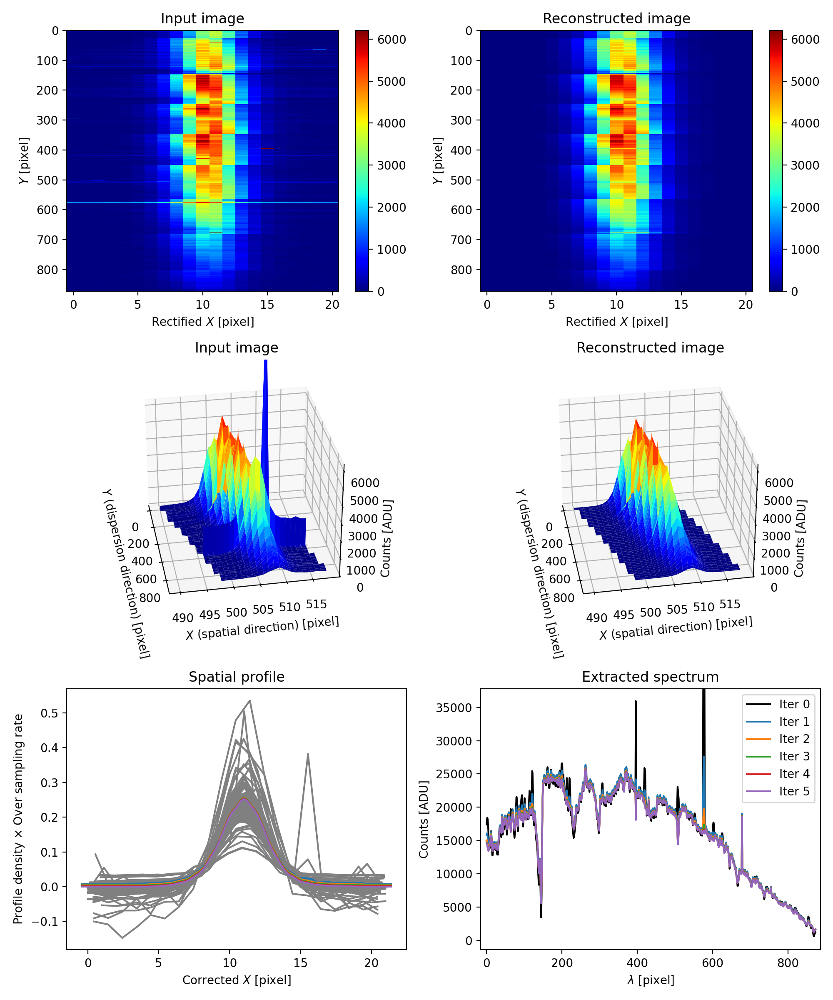

===================
Spectral extraction
===================

P&V(2002) algorithm
-------------------
The original `P&V (2002) algorithm <https://ui.adsabs.harvard.edu/abs/2002A%26A...385.1095P/abstract>`_ minimizes the cost

.. math::

    F =& \sum_{\lambda, x} \left[ f_{\lambda} \sum_{j} w_{\lambda x}^{j} g_{j} - S_{\lambda,x} \right]^2 \\
    &+ \Lambda \sum_j \left( g_{j+1} - g_{j}\right)^2.

By zeroing its derivatives we obtain:

.. math::

    0 &= \frac{\partial F}{\partial f_\lambda} \\
    &= \frac{\partial}{\partial f_\lambda} \sum_{\lambda, x} \left[ f_{\lambda} \sum_{j} w_{\lambda x}^{j} g_{j} - S_{\lambda,x} \right]^2 \\
    &= 2 \sum_{x} \left[ f_{\lambda} \sum_{j} w_{\lambda x}^{j} g_{j} - S_{\lambda,x} \right] \cdot \left( \sum_{j} w_{\lambda x}^{j} g_{j} \right) \\
    &= 2 f_{\lambda} \cdot \sum_{x} \left( \sum_{j} w_{\lambda x}^{j} g_{j} \right)^2 - 2 \sum_{x} S_{\lambda,x}  \left( \sum_{j} w_{\lambda x}^{j} g_{j} \right)

and

.. math::

    0 =& \dfrac{\partial F}{\partial g_k} \\
    =& 2 \sum_{\lambda,x} f_\lambda^2 \left( \sum_{j} w_{\lambda,x}^j g_j \right) w_{\lambda,x}^k	- 2 \sum_{\lambda,x} S_{\lambda,x} f_\lambda w_{\lambda,x}^k \\
     &+ 2 \Lambda \left( -g_{k+1} + 2 g_{k} + g_{k-1} \right).

Therefore, the extracted 1D spectrum :math:`f_\lambda` and spatial profile :math:`g_j` can be updated by:

.. math::

    & \sum_j (\boldsymbol{\mathrm{A}}_{jk} + \Lambda \boldsymbol{\mathrm{B}}_{jk}) g_j=\boldsymbol{\mathrm{R}}_k \\
	& f_\lambda = \boldsymbol{\mathrm{C}}_\lambda / \boldsymbol{\mathrm{D}}_\lambda

where

.. math::

	& \boldsymbol{\mathrm{A}}_{jk} = \sum_{\lambda,x}f_\lambda^2 w_{\lambda,x}^j w_{\lambda,x}^k \\
	& \boldsymbol{\mathrm{R}}_{k} = \sum_{\lambda,x} S_{\lambda, x} f_\lambda w_{\lambda,x}^k \\
	& \boldsymbol{\mathrm{C}}_{\lambda} = \sum_{x} S_{\lambda, x} \sum_j w_{\lambda,x}^j g_j \\
	& \boldsymbol{\mathrm{D}}_{\lambda} = \sum_{x} \left[ \sum_j w_{\lambda,x}^j g_j \right]^2

Improvement
-----------

An improvement based on the original P&V (2002) algorithm is to take into account sky light :math:`l_\lambda`,
which is a constant component at each :math:`\lambda`.
The cost should be rewritten as

.. math::

    F =& \sum_{\lambda, x} \left[ f_{\lambda} \sum_{j} w_{\lambda x}^{j} g_{j} + l_\lambda - S_{\lambda,x} \right]^2 \\
    &+ \Lambda_1 \sum_j \left( g_{j+1} - g_{j}\right)^2 \\
    &+ \Lambda_2 \sum_\lambda \left| l_\lambda \right|.

Therefore, the extracted 1D spectrum :math:`f_\lambda` and spatial profile :math:`g_j` can be updated by:

.. math::

    & \sum_j (\boldsymbol{\mathrm{A}}_{jk} + \Lambda \boldsymbol{\mathrm{B}}_{jk}) g_j=\boldsymbol{\mathrm{R'}}_k \\
	& f_\lambda = \boldsymbol{\mathrm{C'}}_\lambda / \boldsymbol{\mathrm{D}}_\lambda \\
    & l_\lambda = \left( \sum_x S_{\lambda,x} - \sum_x f_\lambda\sum_j w_{\lambda,x}^j g_j - \Lambda_2 \right) / N_x

where

.. math::

	& \boldsymbol{\mathrm{A}}_{jk} = \sum_{\lambda,x}f_\lambda^2 w_{\lambda,x}^j w_{\lambda,x}^k \\
	& \boldsymbol{\mathrm{R'}}_{k} = \sum_{\lambda,x} (S_{\lambda, x}-l_\lambda) f_\lambda w_{\lambda,x}^k \\
	& \boldsymbol{\mathrm{C'}}_{\lambda} = \sum_{x} (S_{\lambda, x}-l_\lambda) \sum_j w_{\lambda,x}^j g_j \\
	& \boldsymbol{\mathrm{D}}_{\lambda} = \sum_{x} \left[ \sum_j w_{\lambda,x}^j g_j \right]^2.

---------------------------
A long-slit galaxy spectrum
---------------------------

--------
Tutorial
--------

.. code-block:: python

    # load data
    import joblib
    data = joblib.load("./spec2d.z")
    ap_xx = data['ap_xx']
    ap_yy = data['ap_yy']
    ap_img = data['ap_img']
    ap_remainders = data['ap_remainders']
    # ap_img[10, 5:8] = 50000

    # initiate PV2002 solver
    from songcn.core.pv2002 import PV2002
    pv = PV2002(S_lambda_x=ap_img, remainders=ap_remainders, osr=5, Lrel=10, xx=ap_xx, yy=ap_yy)

    # reduce spectrum
    pv.reduce(n_iter=10, tol_f_lambda=1e-3, tol_g_j=1e-10)

    # plot result
    fig = pv.plot_result()

This tutorial on using this P&V algorithm implementation is available at https://nbviewer.org/github/hypergravity/songcn/blob/master/tutorials/Tutorial_PV2002.ipynb.

Test data is at https://github.com/hypergravity/songcn/blob/master/songcn/data/test_pv2002/spec2d.z.

---
API
---

.. autoclass:: songcn.core.pv2002.PV2002
    :members:
